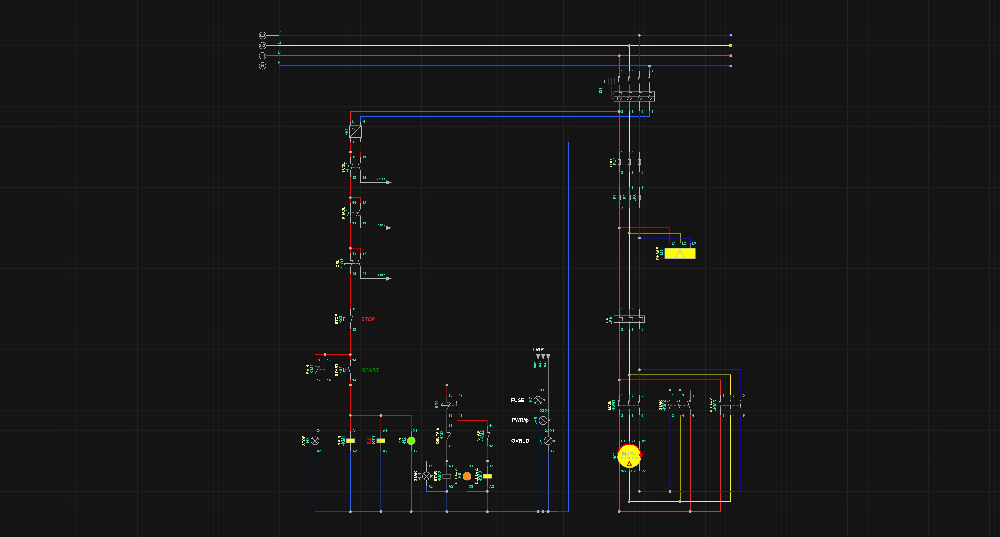
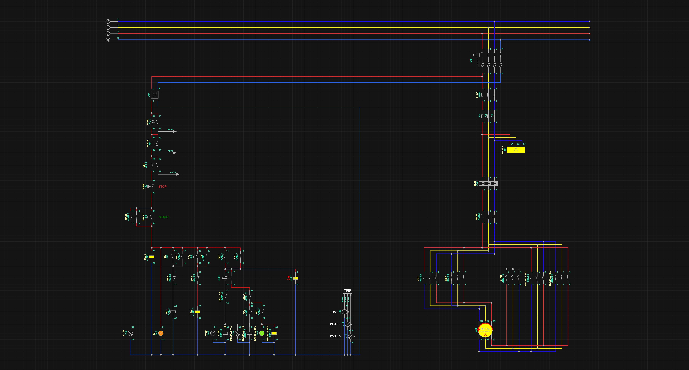
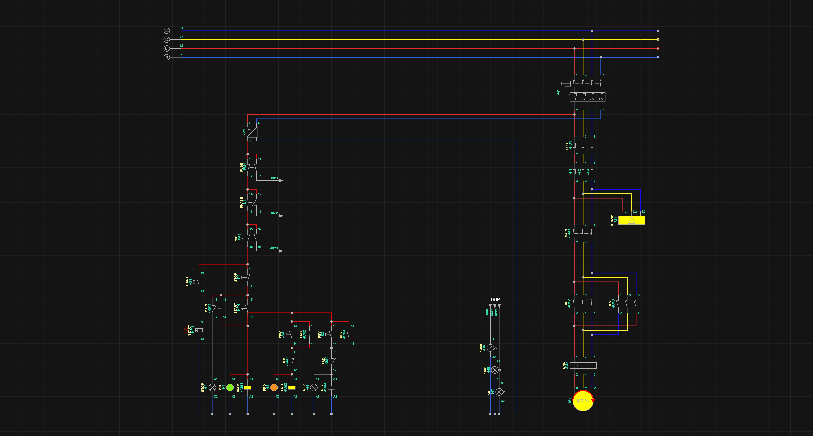

# Electrical_Diagrams_Simurelay
---
## 3-Phase Motor Control Schematics
Electrical schematics for controlling 3-phase induction motors. These designs cover various starting methods and directional controls used in industrial automation.
These circuits are designed to provide  control and protection for 3-phase motors. Each schematic integrates safety logic and visual feedback to ensure reliable industrial operation.

#### Technical Features:
* **Comprehensive Protection:** Circuits include protection for **Overload (OVRDL)**, **Short-circuit (Fuses)**, and **Phase Monitoring** (L1, L2, L3).
* **Visual Signaling:** Integrated control lights for **Power (PWR)**, **Running status**, and **Trip/Fault** conditions.
* **Automatic Transition:** Use of timing relays (KT) for automatic Star-to-Delta switching to reduce inrush current.
* **Forward/Reverse Logic:** Electrical interlocking to prevent simultaneous activation of opposing contactors.
  
### Schematics Gallery

| Schematic Image | Name | Key Description |
| :--- | :--- | :--- |
|  | **Star-Delta Starter** | Classic reduced-voltage starter. It starts the motor in **Star** configuration and automatically switches to **Delta** via a timing relay to protect the grid from high starting currents. |
|  | **Star-Delta Forward/Reverse** | An advanced control system that combines Star-Delta starting with directional control. Includes full interlocking and status LEDs for both directions. |
|  | **Forward/Reverse** | Focuses on a Forward/Reverse operations, ensuring the motor is fully stopped or the system is ready before reversing rotation. |

## Key Components
| Component Tag | Function |
| :--- | :--- |
| **Q1 / Fuses** | Primary short-circuit protection for the power stage. |
| **OVRDL / FA1** | Thermal overload relay to prevent motor burnout. |
| **KT1** | Timing relay for automatic Star $\rightarrow$ Delta transition. |
| **Phase Monitor** | Safety relay that cuts power if a phase is lost or reversed. |
| **H** | Indicator lamps for Phase status, ON/OFF, Run, Star/Delta, and Fault (Trip: Phase, Overload & Fuses). |

---
